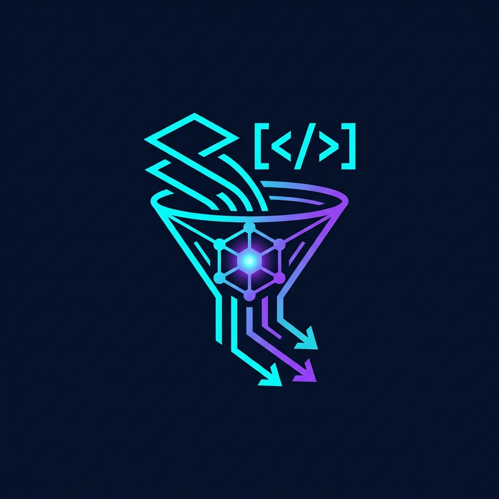

<div align="center">
  
  <h1>Atomo</h1>
  <p><strong>A Lean, Local-First Autonomous Engineering Team</strong></p>
</div>

---

## ⚡ Overview

**Atomo** is a high-capability, local-first agent system built on the `@anthropic-ai/claude-agent-sdk`. It replaces fragmented developer tools with powerful, hyper-focused AI agents that serve as your personal autonomous GitHub engineering organization.

Atomo connects directly to your local GitHub CLI (`gh`) and operates natively on your local file system, securely interacting with your codebase without requiring complex orchestrators. 

## 🧠 The Agent Protocol

Atomo is broken down into purpose-built agents running specific reasoning-and-acting (ReAct) loops:

- **The Triage Agent** (`npm run triage`): Acts as a gatekeeper. It fetches open issues, applies heuristics to categorize them (Bugs, Enhancements, Questions), and engages in automated clarification loops via GitHub comments if the context is insufficient.
- **The Planner** (`npm run plan`): Acts as the technical architect. Reads triage-ready issues, scans the local codebase using `grep` and `glob`, and writes robust, actionable technical specifications.
- **The Dev Agent** (`npm run dev`): The execution engine. Ingests specs and surgically alters source code autonomously (sub-tasking, editing, atomic commits) to implement features or fix bugs.
- **The Product Manager** (`npm run pm`): Manages the broader context, issue state, and QA cycles.

## 🚀 Features

- **Zero-Guessing Priority**: Agents apply strict gatekeeping. If an issue lacks a stack trace or clear repro steps, Atomo asks clarifying questions instead of hallucinating.
- **Codebase-Aware Context**: Uses native local file operations (`read`, `write`, `grep`, `bash`) to pull exact context files, bypassing token bloat.
- **Chain-of-Thought Execution**: Deterministic heuristic matrix processing guarantees high-quality decisions before touching code.
- **Extremely Local & Secure**: Runs entirely on your machine. Everything routes through your local, authenticated `gh` CLI session and file-system paths. 

## 🛠 Prerequisites

1. **[Node.js](https://nodejs.org)** (v20+)
2. **[TypeScript / tsx](https://github.com/privatenumber/tsx)**
3. **[GitHub CLI (`gh`)](https://cli.github.com/)** – authenticated by running `gh auth login`.
4. **Anthropic API Key**

## 📦 Installation

```bash
# Clone your repository
git clone git@github.com:your-username/atomo.git
cd atomo

# Install dependencies
npm install

# Setup environment variables
cp .env.example .env
# Edit .env and add your ANTHROPIC_API_KEY and TARGET_REPO_PATH

# Init and validate your setup
npm run init
```

## 🎮 Command Center

Atomo exposes dedicated run scripts aligned to individual workflow roles:

| Command | Action |
| --- | --- |
| `npm run triage` | Scans GitHub issues, categorizes, and filters out ambiguous requests. |
| `npm run plan` | Maps validated issues to technical plans and acceptance criteria. |
| `npm run dev` | Executes technical specifications natively on the active branch. |
| `npm run pm` | High-level management of issues and contextual coordination. |
| `npm run init` | One-time CLI setup to define agent memory files. |


## 🧪 Testing

Atomo dogfoods TDD - all agents are tested according to `protocols/tdd.md`.

### Running Tests

```bash
npm test                  # Run all tests
npm run test:watch        # Run tests in watch mode
npm run test:ui           # Open Vitest UI
npm run test:coverage     # Generate coverage report
```

### Test Coverage

Current coverage: **80%+** (target threshold defined in `vitest.config.ts`)

[](https://github.com/guyklainer/atomo/actions/workflows/test.yml)

### Test Structure

- `tests/reviewer.test.ts` - Reviewer agent test suite (JSONL parsing, aggregation, formatting)
- More tests coming as we expand coverage to other agents

See `CONTRIBUTING.md` for testing guidelines when adding new features.

## 📐 Internal Architecture

Atomo relies strictly on **Persistent Memory** (`CLAUDE.md` and explicit `protocols/`) combined with **Auto-Memory** directories (`.claude/agent-memory/`) to establish ground rules and observe project-specific idiosyncrasies continually.

## ☁️ Production Deployment

Running Atomo reliably in production (scheduled, automated, or cloud-hosted)?

See the **[Production Deployment Playbook](docs/DEPLOYMENT.md)** for complete guides on:

- **GitHub Actions** (CI/CD automation - free for most projects)
- **Docker** (containerized deployment - enterprise-ready)
- **Self-hosted cron jobs** (VPS, dedicated servers)
- **Cloud platforms** (Railway, Render, AWS Lambda, Fly.io)

All patterns support both **individual agent scheduling** (triage/plan/dev on different schedules) and **full pipeline orchestration** (sequential execution).

**Quick start**: For OSS projects, use the GitHub Actions pattern (10 min setup, zero cost).

## 🤝 Contributing

We highly appreciate contributions! Atomo is built to be modular, and there is a lot of room to grow. 

Feel free to open issues or submit pull requests for:
- 🧠 **New Agents** (e.g., UI Tester Agent, Security Audit Agent)
- ⚙️ **Heuristic Improvements** (Refining the categorization matrices)
- 🐛 **Bug Fixes & Refactors**
- 📚 **Documentation Improvements**

---

<div align="center">
  <sub>Built with ❤️ utilizing the Anthropic Claude Agent SDK.</sub>
</div>
